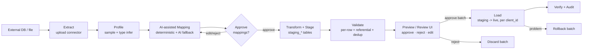

# Safe, AI-Assisted ETL Pipeline — Design

**Scope:** Import data from an external (unknown-schema) database into ChurchGenius Pro's multi-tenant application database, targeting the `family`, `income`, and `expense` tables, driven from the Service Admin area (`/serviceadminhome`).

**Primary safety guarantees**

1. **Tenant isolation** — every staged and loaded row is bound to exactly one `client_id`; cross-tenant writes are structurally impossible.
2. **No silent overwrite** — existing tenant rows are never modified unless a human explicitly approves a matched update.
3. **Staging-first** — nothing touches a live table until it has passed validation, preview, and human approval.
4. **Reversible** — every committed import is a `batch` that can be rolled back as a unit.
5. **Auditable & debuggable** — every source row is traceable to its staged row, its mapping, its validation result, and its final target row (or rejection reason).

---

## 1. High-level flow



The pipeline is a sequence of **idempotent stages**. A run can stop at any stage and be resumed or discarded without side effects on live data, because live tables are only touched in the **Load** stage.

---

## 2. Multi-tenant isolation model

The single most important invariant: **a `client_id` is chosen once, by a Service Admin, at the start of a run, and is stamped onto every staged row and every audit record.** It is never derived from the source data.

Isolation is enforced at four independent layers (defence in depth):

| Layer | Enforcement |
|---|---|
| **Run binding** | An `import_run` row stores the single target `client_id`. The source data has no authority over which tenant it lands in. |
| **Staging columns** | Every `staging_*` row carries `client_id NOT NULL` copied from the run, plus a generated check that it equals the run's `client_id`. |
| **Load query** | Inserts into `family`/`income`/`expense` always set `client_id`/`app_client_id` = run's `client_id`. Any matching/dedup `SELECT` is filtered `WHERE client_id = :runClientId`. |
| **Authorization** | The Service Admin endpoints already run behind the `/api/serviceadmin` auth boundary; the loader additionally verifies the operator is permitted to manage that `client_id` (a real `ServiceClient` row) before any write. |

> This mirrors how the app already isolates tenants today (e.g. `findByClientIdAndDeleteFlagFalse`, `RoleGuard.clientId`, and the `membership_family_member` → `family_member` approval flow). The ETL system reuses that pattern rather than inventing a new one.

**Rule:** no ETL SQL ever runs without a `client_id` bound parameter. Code review / a lint check should reject any loader query that lacks `WHERE client_id = ?` (reads) or a `client_id` value (writes).

---

## 3. Pipeline stages

| # | Stage | Touches live data? | Output |
|---|---|---|---|
| 1 | **Extract** | No | Raw rows captured into `staging_raw` (one JSON blob per source row, per source table) |
| 2 | **Profile** | No | Column inventory, inferred types, null rates, sample values, distinct counts |
| 3 | **Map** (AI-assisted) | No | `mapping_rule` rows with confidence + status (auto / review / rejected) |
| 4 | **Transform + Stage** | No | Typed rows in `staging_family` / `staging_income` / `staging_expense` |
| 5 | **Validate** | No | Per-row `valid` / `warn` / `error` + reasons in `staging_*` |
| 6 | **Preview / Review** | No | Human approve / reject / edit, per row and per batch |
| 7 | **Load** | **Yes** | Inserts (and, only on explicit confirm, updates) into live tables, tagged with `batch_id` |
| 8 | **Verify** | No | Row counts reconciled; audit finalized |
| 9 | **Rollback** (optional) | **Yes** | Undo a `batch_id` as a unit |

Each stage records start/end, operator, counts, and outcome in the audit trail. A run cannot advance to **Load** unless **Validate** has completed and the batch is in `APPROVED` status.

---

## 4. Staging & control schema

All new tables are tenant-scoped and additive (no changes to existing live tables). With Hibernate `ddl-auto=update` they are created automatically; for production a reviewed migration script is preferred.

### 4.1 Control tables

```sql
-- One import attempt, bound to exactly one tenant.
CREATE TABLE import_run (
  id              BIGSERIAL PRIMARY KEY,
  client_id       VARCHAR(64)  NOT NULL,         -- the ONLY tenant this run may write
  created_by      VARCHAR(128) NOT NULL,         -- service-admin operator
  source_label    VARCHAR(256),                  -- e.g. "LegacyChMS export 2026-06"
  status          VARCHAR(24)  NOT NULL,         -- DRAFT|PROFILED|MAPPED|STAGED|VALIDATED|APPROVED|LOADED|ROLLED_BACK|DISCARDED|FAILED
  created_date    TIMESTAMP    NOT NULL DEFAULT now(),
  updated_date    TIMESTAMP
);

-- A load attempt within a run. A run may load family, then income, then expense
-- as separate batches, each independently reversible.
CREATE TABLE import_batch (
  id              BIGSERIAL PRIMARY KEY,
  run_id          BIGINT      NOT NULL REFERENCES import_run(id),
  client_id       VARCHAR(64) NOT NULL,
  target_table    VARCHAR(32) NOT NULL,          -- family|income|expense
  status          VARCHAR(24) NOT NULL,          -- STAGED|APPROVED|LOADED|ROLLED_BACK|FAILED
  approved_by     VARCHAR(128),
  approved_date   TIMESTAMP,
  inserted_count  INT DEFAULT 0,
  updated_count   INT DEFAULT 0,
  skipped_count   INT DEFAULT 0,
  failed_count    INT DEFAULT 0,
  created_date    TIMESTAMP NOT NULL DEFAULT now()
);

-- AI + deterministic mapping decisions (see §6).
CREATE TABLE mapping_rule (
  id              BIGSERIAL PRIMARY KEY,
  run_id          BIGINT      NOT NULL REFERENCES import_run(id),
  target_table    VARCHAR(32) NOT NULL,
  target_column   VARCHAR(64) NOT NULL,          -- e.g. firstName
  source_table    VARCHAR(128),
  source_column   VARCHAR(128),                  -- e.g. first_name
  transform       VARCHAR(64),                   -- trim|titlecase|parse_date|cents_to_dollars|...
  confidence      NUMERIC(4,3),                  -- 0.000–1.000
  status          VARCHAR(16) NOT NULL,          -- AUTO|NEEDS_REVIEW|CONFIRMED|REJECTED
  rationale       TEXT,                          -- why this mapping was suggested
  decided_by      VARCHAR(128),
  UNIQUE (run_id, target_table, target_column)
);

-- Append-only audit of every meaningful action.
CREATE TABLE import_audit (
  id          BIGSERIAL PRIMARY KEY,
  run_id      BIGINT      NOT NULL,
  batch_id    BIGINT,
  client_id   VARCHAR(64) NOT NULL,
  actor       VARCHAR(128) NOT NULL,
  action      VARCHAR(48) NOT NULL,              -- EXTRACT|MAP_SUGGEST|MAP_CONFIRM|VALIDATE|PREVIEW|APPROVE|LOAD|ROLLBACK|...
  detail      JSONB,                             -- counts, params, error summaries
  created_date TIMESTAMP NOT NULL DEFAULT now()
);
```

### 4.2 Staging tables (one per target)

Each staging table mirrors the **target** columns plus bookkeeping columns. Example for `family`:

```sql
CREATE TABLE staging_family (
  id                BIGSERIAL PRIMARY KEY,
  run_id            BIGINT      NOT NULL REFERENCES import_run(id),
  client_id         VARCHAR(64) NOT NULL,
  source_row_id     VARCHAR(128),                -- natural key/locator in the source (traceability)
  source_payload    JSONB       NOT NULL,        -- the exact raw source row
  -- ↓ target-shaped, post-transform columns:
  first_name        VARCHAR(255),
  last_name         VARCHAR(255),
  email             VARCHAR(255),
  phone             VARCHAR(64),
  address1          VARCHAR(255),
  -- ... remaining target columns ...
  -- ↓ pipeline bookkeeping:
  row_status        VARCHAR(16) NOT NULL DEFAULT 'PENDING', -- VALID|WARN|ERROR|APPROVED|REJECTED|LOADED|SKIPPED|FAILED
  validation_msgs   JSONB,                       -- [{field, level, message}]
  dedupe_match_id   BIGINT,                      -- live family_member.id if a duplicate was detected
  dedupe_action     VARCHAR(16),                 -- INSERT|UPDATE|SKIP  (default SKIP unless confirmed)
  target_id         BIGINT,                      -- live row id after load (for rollback + traceability)
  batch_id          BIGINT,
  created_date      TIMESTAMP NOT NULL DEFAULT now()
);
CREATE INDEX ix_stg_family_run   ON staging_family(run_id, row_status);
CREATE INDEX ix_stg_family_tenant ON staging_family(client_id);
```

`staging_income` and `staging_expense` follow the same shape with their own target columns, and additionally carry a **`family_link`** column (see §10) so child rows can be attached to the right family after the family load.

> **Why staging mirrors the target, not the source:** validation and dedup run against the shape we are about to insert, so "what you preview is exactly what gets loaded."

---

## 5. AI-assisted schema mapping module

**Strategy: deterministic first, AI only for the gaps.** This keeps mappings predictable, cheap, and auditable, and uses the model only where rules are genuinely ambiguous.

### 5.1 Deterministic matcher (runs for every column)

For each **target** column, score every **source** column:

1. **Normalize** both names — lowercase, strip non-alphanumerics, singularize, expand known abbreviations (`fname`→`first name`, `dob`→`date of birth`, `amt`→`amount`, `addr`→`address`).
2. **Synonym dictionary** — a curated map per target table (`firstName` ⇐ {`first_name`, `fname`, `given_name`, `givenname`}; `amount` ⇐ {`amt`, `value`, `total`, `donation_amount`}; `pinCode` ⇐ {`zip`, `zipcode`, `postal_code`}).
3. **String similarity** — token-set + Levenshtein on the normalized names.
4. **Type/shape compatibility** — sampled source values must be coercible to the target type (e.g. a target `phone` candidate whose samples are all currency is penalized; a `date` target requires parseable dates).
5. **Score = weighted blend** of (synonym hit, name similarity, type compatibility, fill-rate). Pick the best source column per target.

```
confidence ≥ 0.85  → status = AUTO          (accepted, still shown for review)
0.55 ≤ c < 0.85    → status = NEEDS_REVIEW   (highlighted in the UI)
confidence < 0.55  → status = NEEDS_REVIEW   (and routed to the AI fallback)
no candidate       → status = NEEDS_REVIEW   (unmapped; operator must map or skip)
```

### 5.2 AI fallback (only for `NEEDS_REVIEW` / low-confidence)

For unresolved or ambiguous targets, send a compact prompt to the existing OpenAI integration:

- **Input:** the target column (name + type + description), and the candidate source columns with name + inferred type + 3–5 sample values. Never send full datasets — only the schema and a tiny sample.
- **Output (strict JSON):** `{ "sourceColumn": string|null, "transform": string|null, "confidence": 0–1, "rationale": string }`.
- **Guard rails:** the model's choice is re-checked by the deterministic type/shape validator. If the AI picks a type-incompatible column, the suggestion is downgraded to `NEEDS_REVIEW` and never auto-confirmed. The AI can *suggest* but cannot *auto-approve* — only `AUTO` (high-confidence deterministic) and human action produce `CONFIRMED`.

### 5.3 Outputs

Every target column ends with a `mapping_rule` row carrying: chosen source column, transform, confidence, status, and a human-readable rationale. Ambiguous mappings are surfaced for manual review; nothing in stages 4–7 runs until each required target column is either `CONFIRMED` or explicitly marked "leave blank / skip".

---

## 6. Transform & validation layer

### 6.1 Transforms

Mappings may attach a named, **whitelisted** transform (no arbitrary code): `trim`, `titlecase`, `lowercase_email`, `digits_only` (phone), `parse_date(formats…)`, `cents_to_dollars`, `state_name_to_code`, `default(value)`, `enum_map(table)`. Transforms are pure functions; the original source value is always retained in `source_payload` for traceability.

### 6.2 Validation (per row, before any load)

Run on every staged row; results stored in `validation_msgs` and `row_status`:

- **Schema** — required target fields present; types/lengths fit; enums valid (e.g. `member_type`, transaction type).
- **Format** — email shape, phone digits, date ranges (no future DOB), non-negative `amount`, currency precision.
- **Referential** — `income`/`expense` rows must resolve to a family/source/purpose that will exist in *this tenant* after the family batch loads (see §10). Unresolvable → `ERROR`.
- **Tenant** — `client_id` equals the run's `client_id` (defensive; should always hold).
- **Duplicate detection** — match against live data **scoped to the tenant** (`family_member` by email/phone+name; `income`/`expense` by source natural key or amount+date+fund). A match sets `dedupe_match_id` and `dedupe_action = SKIP` by default.

Levels: `ERROR` blocks the row from loading; `WARN` loads only if the operator approves; `VALID` is loadable. A batch's load **never** includes `ERROR` rows.

---

## 7. No-overwrite & idempotency policy

- **Default is INSERT-or-SKIP, never UPDATE.** A staged row whose duplicate already exists in the tenant is set to `dedupe_action = SKIP` and is *not* written.
- **Updates require explicit, per-row human confirmation.** In the review UI the operator can change a matched row from `SKIP` to `UPDATE`; only then will the loader modify the existing live row — and even then it writes a before-image into the audit so the change is reversible.
- **Idempotent re-runs.** Re-importing the same source file produces the same dedupe matches → all rows `SKIP`, zero new writes. A natural-key fingerprint (`source_row_id` + content hash) prevents the same source row from loading twice within a tenant.
- **Live tables are append-tagged.** Every inserted live row records its `import_batch_id` (a nullable column added to `family_member`/`income`/`expense`, or a side `import_provenance(batch_id, target_table, target_id)` table if you prefer not to alter live tables). This is what makes rollback exact.

---

## 8. Review & Approval UI flow (`/serviceadminhome`)

A wizard added to the Service Admin page, gated to service-admin operators, working strictly on staging data:

1. **Start run** → pick the target **tenant** (`ServiceClient`) and upload/connect the source. *(Tenant is locked for the whole run.)*
2. **Mapping review** — a two-column grid (Target ⇄ Source) showing each suggested mapping, its **confidence score** (color-coded), rationale, and a sample-value preview. `NEEDS_REVIEW` rows are pinned to the top. Operator can **edit** the source column / transform, **confirm**, or **mark skip**. Cannot proceed until all required targets are resolved.
3. **Preview & validation** — paginated, per-table grid of staged rows with `row_status` chips (Valid / Warn / Error), inline validation messages, and a **"View source row"** action that shows the exact `source_payload` (full traceability). Filters: *errors only*, *duplicates*, *warnings*. Per-row controls: **approve / reject / edit**, and for duplicates a toggle **Skip ⇄ Update existing**. Counters at the top: N valid, N warnings, N errors, N duplicates.
4. **Approve batch** — a summary ("Will insert X, update Y, skip Z, block W errors") with an explicit typed confirmation. Approval flips the batch to `APPROVED`.
5. **Load** — runs the transactional loader; shows live progress and a final reconciliation (staged vs inserted).
6. **Post-load** — a batch summary screen with **Rollback this batch** and a downloadable audit/report (CSV) of every row's outcome and source linkage.

Each record in every screen carries its `source_row_id`, so **every imported value is traceable back to its origin row** end-to-end.

---

## 9. Load, partial failure, and rollback

### 9.1 Load (transactional, per batch)

- Load order is fixed: **family → income → expense** (parents before children).
- The loader processes only `row_status IN (VALID, APPROVED)` and `dedupe_action IN (INSERT, UPDATE)`.
- Each insert/update is wrapped so a single bad row **cannot abort the whole batch**: rows are committed in chunks (e.g. 200) inside a per-chunk transaction; a row that fails is marked `FAILED` with the exception captured in `validation_msgs` and the batch continues. (This is "partial failure handling" — good rows load, bad rows are isolated and individually debuggable.)
- Every live row written stores its `batch_id` (or a `import_provenance` row), and the staging row's `target_id` is back-filled.

### 9.2 Row-by-row debugging

Because each staging row keeps `source_payload`, the chosen mapping, the post-transform values, the validation messages, and (after load) the `target_id` or the failure exception, an operator can open any failed row and see exactly: source → mapped values → why it failed. Re-running a fix re-stages and re-validates just the corrected rows.

### 9.3 Rollback

Two complementary mechanisms:

- **Batch reversal (primary).** "Rollback batch N" deletes (or soft-deletes via the existing `delete_flag`) every live row tagged with `batch_id = N`, and restores before-images for any rows that were `UPDATE`d (before-images live in the audit). Children are reversed before parents. The batch flips to `ROLLED_BACK`; the audit records the reversal. Because the batch only ever *added* rows or made operator-confirmed updates with saved before-images, the tenant returns to its exact pre-load state and **no other tenant or non-batch row is touched** (every reversal query is `WHERE client_id = :runClientId AND import_batch_id = :batchId`).
- **Discard before load.** Any run/batch that hasn't reached `LOADED` is discarded by dropping its staging rows — zero live impact, since nothing was written.

> Soft-delete (`delete_flag = true`) is the safer default for rollback in production because it preserves history and is itself reversible; hard delete is available for clean re-imports.

---

## 10. Cross-table relationships (`family` → `income`/`expense`)

`income` and `expense` reference a member/family within the tenant. The pipeline keeps a **per-run link map**:

- During family load, record `source_family_key → new family_member.id` in a `run_id`-scoped lookup.
- Stage `income`/`expense` with the **source's** family key in `family_link`; at income/expense load time, resolve `family_link` through the link map (and, for already-existing families, through the tenant-scoped dedupe match).
- A child row whose `family_link` cannot be resolved within the tenant is a **validation ERROR** (never silently attached to the wrong family), and is held for the operator to map or skip.

This guarantees children attach only to the correct family **inside the same tenant**.

---

## 11. Logging, audit trail & production safety

- **Audit (`import_audit`)** is append-only and records every stage transition, mapping confirmation, approval, load, and rollback with actor, counts, and parameters — reusing the spirit of the app's existing `AccessAudit`.
- **Provenance** — every live row knows its `batch_id`; every staging row knows its `source_row_id` and `source_payload`. Full bidirectional traceability.
- **Least privilege** — the importer runs behind the Service Admin auth boundary; the loader re-checks the operator may manage the chosen `ServiceClient`.
- **No secrets / no raw dataset to the model** — only schema + tiny samples are sent to the AI mapper.
- **Dry-run parity** — Preview computes exactly what Load will do (same dedupe + validation code path), so "preview = reality."
- **Backups** — take/confirm a DB snapshot before a large Load; rollback is the fast path, the snapshot is the safety net.
- **Concurrency** — one active `LOADED`-bound batch per `(client_id, target_table)` at a time to avoid interleaved writes.

---

## 12. Failure modes & safeguards (summary)

| Risk | Safeguard |
|---|---|
| Wrong tenant gets data | `client_id` bound at run start, stamped on every staged row, enforced in every load/rollback query |
| Overwriting good data | INSERT-or-SKIP default; UPDATE only on explicit per-row confirm with saved before-image |
| Bad mapping (`first_name`→wrong field) | Confidence scoring + mandatory review of `NEEDS_REVIEW`; type-compatibility re-check on AI output |
| One bad row kills the import | Chunked transactions; failed rows isolated as `FAILED`, batch continues |
| Can't undo | Batch is reversible as a unit (soft-delete + before-images) |
| Duplicates | Tenant-scoped dedupe + content-hash idempotency |
| Orphaned income/expense | Per-run family link map; unresolved links are validation errors |
| Can't diagnose a failure | Each row keeps source payload + mapping + validation + target id / exception |

---

## 13. Suggested API surface (Service Admin)

All under the existing `/api/serviceadmin/...` auth boundary; all require an explicit `clientId`.

```
POST   /api/serviceadmin/etl/runs                 {clientId, sourceLabel}            -> create run
POST   /api/serviceadmin/etl/runs/{id}/extract    (file upload / connection)         -> stage_raw + profile
GET    /api/serviceadmin/etl/runs/{id}/mappings                                       -> suggested mappings
PUT    /api/serviceadmin/etl/runs/{id}/mappings   {target,source,transform,confirm}  -> edit/confirm
POST   /api/serviceadmin/etl/runs/{id}/stage      {targetTable}                       -> transform + validate
GET    /api/serviceadmin/etl/runs/{id}/preview    ?table=&filter=errors&page=        -> paged staged rows
PATCH  /api/serviceadmin/etl/rows/{id}            {rowStatus|dedupeAction|values}     -> approve/reject/edit row
POST   /api/serviceadmin/etl/batches             {runId,targetTable}                 -> create+approve batch
POST   /api/serviceadmin/etl/batches/{id}/load                                        -> transactional load
POST   /api/serviceadmin/etl/batches/{id}/rollback                                    -> reverse batch
GET    /api/serviceadmin/etl/batches/{id}/report                                      -> per-row outcome CSV
```

---

## 14. Implementation phases

1. **Foundation** — control + staging tables; run lifecycle; tenant-binding + audit. (No live writes yet.)
2. **Extract + Profile** — file/connector ingestion into `staging_raw`; column profiling.
3. **Mapping** — deterministic matcher + synonym dictionaries + confidence; AI fallback wired to the existing OpenAI integration; mapping review API.
4. **Transform + Validate** — whitelisted transforms; validation rules incl. tenant-scoped dedupe and family-link resolution.
5. **Preview/Approval UI** — the `/serviceadminhome` wizard (mapping grid, preview grid, approval, source traceability).
6. **Load + Rollback** — chunked transactional loader, provenance tagging, batch rollback, reconciliation report.
7. **Hardening** — partial-failure paths, concurrency guard, backups runbook, end-to-end audit verification.

---

### TL;DR

External data lands in **tenant-stamped staging tables**, is mapped by a **deterministic engine with an AI fallback that can suggest but never auto-approve**, is **validated and previewed with full source traceability**, is loaded **only after explicit human approval** as an **insert-or-skip batch tagged with a `batch_id`**, and any batch can be **rolled back as a unit** — so existing data for the chosen tenant and **all other tenants** is never silently changed.
